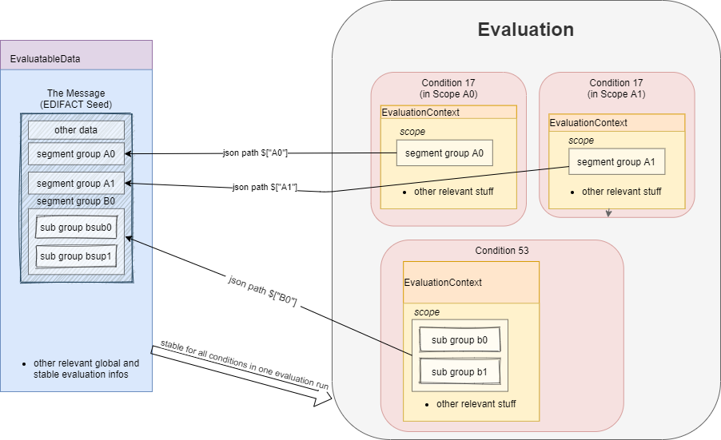

# Content Evaluation

Evaluation is the term used for the processing of _single_ unevaluated conditions.
The results of the evaluation of all relevant conditions inside a message can then be used to validate a message.
The latter is **not** part of the evaluation.

## EvaluatableData (Edifact Seed and others)

For the evaluation of a condition (that is referenced by its key, e.g. "17") it is necessary to have a data basis that allows to decide whether the respective condition is met or not met.
This data basis that is stable for all conditions that are evaluated in on evaluation run is called **`EvaluatableData`**.
These data usually contain the **edifact seed** (a JSON representation of the EDIFACT message) but may also hold other information.
The `EvaluatableData` class acts a container for these data.

## EvaluationContext (Scope and others)

While the data basis is stable, the context in which a condition is evaluated might change during on evaluation run.
The same condition can have different evaluation results depending on e.g. in which scope it is evaluated.
A **scope** is a (json) path that references a specific subtree of the edifact seed.
For example one "Vorgang" (`SG4 IDE`) in UTILMD could be a scope.
If a condition is described as

> There has to be exactly one xyz per Vorgang (SG4+IDE)

Then for `n` Vorgänge there are `n` scopes:

- one scope for each Vorgang (pathes refer to an edifact seed):
  - `$["Dokument"][0]["Nachricht"][0]["Vorgang"][0]`
  - `$["Dokument"][0]["Nachricht"][0]["Vorgang"][1]`
  - ...
  - `$["Dokument"][0]["Nachricht"][0]["Vorgang"][<n-1>]`

Each of the single vorgang scopes can have a different evaluation result.
Those results are relevant for the user when entering data, probably based in a somehow Vorgang-centric manner.

The **`EvaluationContext`** class is a container for the scope and other information that are relevant for a single condition and a single evaluation only but (other than `EvaluatableData`) might change within an otherwise stable message.

<!-- The raw and updated data for this diagram can be found in the [draw_io_charts repository](https://github.com/Hochfrequenz/draw_io_charts/tree/main/wimbee/) and edited under [app.diagrams.net](https://app.diagrams.net/#HHochfrequenz%2Fdraw_io_charts%2Fmain%2Fwimbee%2FEvaluatingConditions.drawio) with your Hochfrequenz GitHub Account. -->
