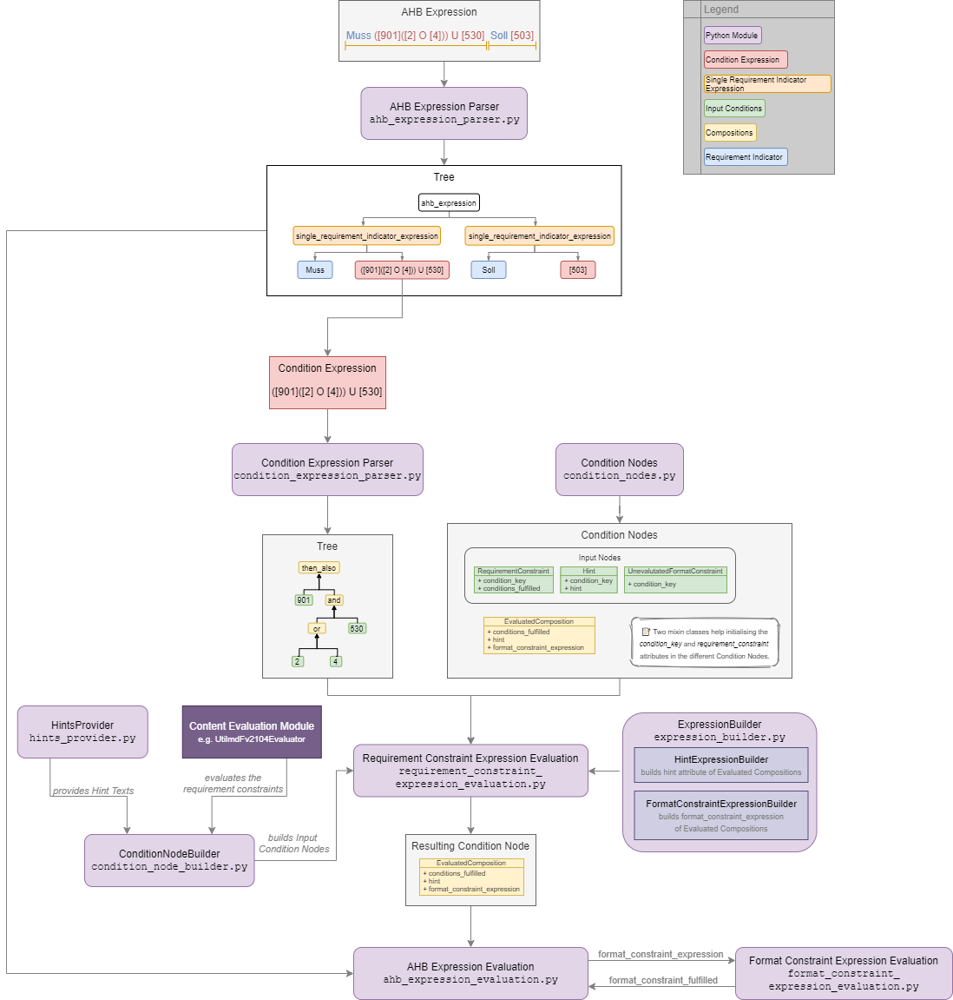

# Mussfeldprüfung / Condition check

Condition check (Mussfeldprüfung), that examines and evaluates expressions like `Muss [59] U ([123] O [456])` from the AHBs (edi@energy documents) by parsing it with the [parsing library `lark`](https://lark-parser.readthedocs.io/en/latest/):

See also [edi-energy.de → Dokumente → Allgemeine Festlegungen](https://www.edi-energy.de/index.php?id=38&tx_bdew_bdew%5Buid%5D=956&tx_bdew_bdew%5Baction%5D=download&tx_bdew_bdew%5Bcontroller%5D=Dokument&cHash=ae3c1bd6fe3f664cd90f5e94f9714e3e) which contains explanation how the Bedingungen are supposed to be read.

## Functionality

(as of 2021-06-11)

- Expressions can contain single numbers e.g. `[47]` or numbers combined with `U`/`O`/`X` which are translated to boolean operators `and`/`or`/`exclusive or`, e.g. `[45]U[2]` or they can be combined **without** an operator, e.g. `[930][5]` in the case of FormatConstraints.
- Expressions can contain random whitespaces.
- Input conditions are passed in form of a `ConditionNode`, see below.
- Bedingungen/`RequirementConstraints` with a boolean value, Hinweise/`Hints` and Formatdefinitionen/`FormatConstraints` are so far functionally implemented as the result returns if the condition expression is fulfilled and which Hints and FormatConstraints are relevant.
- The boolean logic follows 'brackets `( )` before `then_also` before `and` before `or`'.
- Hints and UnevaluatedFormatConstraints are implemented as `neutral` element, so not changing the boolean outcome of an expression for the evaluation regarding the requirement constraints and raising errors when there is no sensible logical outcome of the expression.
- A `condition_fulfilled` attribute can also take the value `unknown`.
- Brackets e.g. `([43]O[4])U[5]`
- Requirement indicators (i.e `Muss`, `Soll`, `Kann`, `X`, `O`, `U`) are seperated from the condition expressions and also seperated into single requirement indicator expressions if there are more than one (for modal marks).
- `Format Constraint Expressions` that are returned after the requirement condition evaluation can now be parsed and evaluated.
- Evaluate several modal marks in one ahb_expression: the first one that evaluates to fulfilled is the valid one.

### In planning:

- Evaluate requirement indicators:
  - Soll, Kann, Muss, X, O, U -> is_required, is_forbidden, etc...

## Definition of terms:

| Term                                           | Description                                                                                                                                                                                                                                                                                                                                                                                                                                                                                                                   | Example                                                                                                               |
| ---------------------------------------------- | ----------------------------------------------------------------------------------------------------------------------------------------------------------------------------------------------------------------------------------------------------------------------------------------------------------------------------------------------------------------------------------------------------------------------------------------------------------------------------------------------------------------------------- | --------------------------------------------------------------------------------------------------------------------- |
| `condition`                                    | single operand                                                                                                                                                                                                                                                                                                                                                                                                                                                                                                                | `[53]`                                                                                                                |
| `condition_key`                                | `int` or `str`, the number of the condition                                                                                                                                                                                                                                                                                                                                                                                                                                                                                   | `53`                                                                                                                  |
| `operator`                                     | combines two conditions                                                                                                                                                                                                                                                                                                                                                                                                                                                                                                       | `U`, `O`                                                                                                              |
| `composition`                                  | two parts of an expression combined by an operator   used in the context of the parsing and evaluation of the expression                                                                                                                                                                                                                                                                                                                                                                                                   | `([4]U[76])O[5]` consists of an `and_composition` of `[4]` and `[76]` and an `or_composition` of `[4]U[76]` and `[5]` |
| `ahb expression`                               | an expression as given from the ahb   Consists of at least one single requirement indicator expression.   In case of several model mark expressions the first one will be evaluated and if not fulfilled, it will be continued with the next one.                                                                                                                                                                                                                                                                       | `X[59]U[53]`  `Muss[59]U([123]O[456])Soll[53]`                                                                     |
| `single requirement indicator expression`      | An expression consisting of exactly one requirement indicator and their respective condition expression.   If there is only one requirement indicator in the ahb expression, then both expressions are identical.                                                                                                                                                                                                                                                                                                          | `Soll[53]`                                                                                                            |
| `condition expression`                         | one or multiple conditions combined with or (in case of FormatConstraints) also without operators   used as input for the condition parser                                                                                                                                                                                                                                                                                                                                                                                 | `[1]`   `[4]O[5]U[45]`                                                                                             |
| `format constraint expression`                 | Is returned after the evaluation of the RequirementConstraints   consist only of FormatConstraints                                                                                                                                                                                                                                                                                                                                                                                                                         | `[901]X[954]`                                                                                                         |
| `requirement indicator`                        | The Merkmal/modal_mark or Operator/prefix_operator of the data element/data element group/segment/segment group.                                                                                                                                                                                                                                                                                                                                                                                                              | `Muss`, `Soll`, `Kann`, `X`, `O`, `U`                                                                                 |
| `Merkmal` / `modal_mark`                       | as defined by the EDI Energy group (see [edi-energy.de → Dokumente → Allgemeine Festlegungen](https://www.edi-energy.de/index.php?id=38&tx_bdew_bdew%5Buid%5D=956&tx_bdew_bdew%5Baction%5D=download&tx_bdew_bdew%5Bcontroller%5D=Dokument&cHash=ae3c1bd6fe3f664cd90f5e94f9714e3e))   Stands alone or before a condition expression, can be the start of several requirement indicator expressions in one ahb expression                                                                                                    | `Muss`, `Soll`, `Kann`                                                                                                |
| `Muss`                                         | Is required for the correct structure of the message   If the following condition is not fulfilled, the information **must not** be given.                                                                                                                                                                                                                                                                                                                                                                                 |
| `Soll`                                         | Is required for technical reasons.   Always followed by a condition.   If the following condition is not fulfilled, the information **must not** be given.                                                                                                                                                                                                                                                                                                                                                              |
| `Kann`                                         | Optional                                                                                                                                                                                                                                                                                                                                                                                                                                                                                                                      |
| `prefix operator`                              | Operator which does not function to combine conditions, but as requirement indicator.   Stands alone or in front of a condition expression.                                                                                                                                                                                                                                                                                                                                                                                | `X`, `O`, `U`                                                                                                         |
| `tree`, `branches`, `token`                    | as used by lark                                                                                                                                                                                                                                                                                                                                                                                                                                                                                                               |
| `ConditionNode`                                | Defines the nodes of the tree as they are passed, evaluated und returned.   There are different kinds of conditions (`Bedingung`, `Hinweis`, `Format`) as defined by the EDI Energy group (see [edi-energy.de → Dokumente → Allgemeine Festlegungen](https://www.edi-energy.de/index.php?id=38&tx_bdew_bdew%5Buid%5D=956&tx_bdew_bdew%5Baction%5D=download&tx_bdew_bdew%5Bcontroller%5D=Dokument&cHash=ae3c1bd6fe3f664cd90f5e94f9714e3e)) and also a `EvaluatedComposition` after a composition of two nodes is evaluated. | `RequirementConstraint`, `FormatConstraint`, `Hint`, `EvaluatedComposition`                                           |
| `Bedingung` / `RequirementConstraint` (`rc`)   | - are true or false, has to be determined   - keys between `[1]` and `[499]`                                                                                                                                                                                                                                                                                                                                                                                                                                               | "falls SG2+IDE+CCI == EHZ"                                                                                            |
| `Hinweis` / `Hint`                             | - just a hint, even if it is worded like a condition   - keys from `[500]` onwards, starts with 'Hinweis:'                                                                                                                                                                                                                                                                                                                                                                                                                 | "Hinweis: 'ID der Messlokation'"   "Hinweis: 'Es ist der alte MSB zu verwenden'"                                   |
| `Formatdefinition` / `FormatConstraint` (`fc`) | - a constraint for how the data should be given   - keys between `[901]` and `[999]`, starts with 'Format:'  Format Constraints are "collected" while evaluating the rest of the tree, meaning the evaluated composition of the Mussfeldprüfung contains an expression that consists only of format constraints.                                                                                                                                                                                                        | "Format: Muss größer 0 sein"   "Format: max 5 Nachkommastellen"                                                    |
| `UnevaluatedFormatConstraint`                  | A format constraint that is just "collected" during the requirement constraint evaluation. To have a clear separation of conditions that affect whether a field is mandatory or not and those that check the format of fields without changing their state it will become a part of the `format_constraint_expression` which is part of the `EvaluatedComposition`.                                                                                                                                                           |
| `EvaluatableFormatConstraint`                  | An evaluatable FormatConstraint will (other than the `UnevaluatedFormatConstraint`) be evaluated by e.g. matching a regex, calculating a checksum etc. This happens _after_ the Mussfeldprüfung. (_details to be added upon implementing_)                                                                                                                                                                                                                                                                                    |
| `EvaluatedComposition`                         | is returned after a composition of two nodes is evaluated                                                                                                                                                                                                                                                                                                                                                                                                                                                                     |
| `neutral`                                      | Hints and UnevaluatedFormat Constraints are seen as neutral as they don't have a condition to be fulfilled or unfulfilled and should not change the requirement outcome. See truth table below.                                                                                                                                                                                                                                                                                                                               |
| `unknown`                                      | If the condition can be fulfilled but we don't know (yet) if it is or not. See truth table below.                                                                                                                                                                                                                                                                                                                                                                                                                             | "Wenn vorhanden"                                                                                                      |

The decision if a requirement constraint is met / fulfilled / true is made in the content evaluation module. See [its README](evaluation/README_Evaluation.md).

## Program structure

The following diagram shows the structure of the condition check for more than one condition. If it is only a single condition or just a requirement indicator, the respective tree consists of just this token and the result equals the input.

The raw and updated data for this diagram can be found in the [draw_io_charts repository](https://github.com/Hochfrequenz/draw_io_charts/tree/main/wimbee/conditions) and edited under [app.diagrams.net](https://app.diagrams.net/#HHochfrequenz%2Fdraw_io_charts%2Fmain%2Fwimbee%2Fconditions%2FCondition_Structure_with_more_than_one_condition.drawio) with your GitHub Account.

## Truth tables

Additionally to the usual boolean logic we also have `neutral` elements (e.g. `Hints`, `UnevaluatedFormatConstraints` and in some cases `EvaluatedCompositions`) or `unknown` requirement constraints. They are handled as follows:

### `and_composition`

| A       | B       | A U B   |
| ------- | ------- | ------- |
| Neutral | True    | True    |
| Neutral | False   | False   |
| Neutral | Neutral | Neutral |
| Unknown | True    | Unknown |
| Unknown | False   | False   |
| Unknown | Unknown | Unknown |
| Unknown | Neutral | Unknown |

### `or_composition`

| A       | B       | A O B               | note                                             |
| ------- | ------- | ------------------- | ------------------------------------------------ |
| Neutral | True    | does not make sense |
| Neutral | False   | does not make sense |
| Neutral | Neutral | Neutral             | no or_compositions of hint and format constraint |
| Unknown | True    | True                |
| Unknown | False   | Unknown             |
| Unknown | Unknown | Unknown             |
| Unknown | Neutral | does not make sense |

### `xor_composition`

| A       | B       | A X B               | note                                              |
| ------- | ------- | ------------------- | ------------------------------------------------- |
| Neutral | True    | does not make sense |
| Neutral | False   | does not make sense |
| Neutral | Neutral | Neutral             | no xor_compositions of hint and format constraint |
| Unkown  | True    | Unknown             |
| Unkown  | False   | Unknown             |
| Unkown  | Unknown | Unknown             |
| Unkown  | Neutral | does not make sense |

Link to automatically generate HintsProvider Json content: https://regex101.com/r/za8pr3/5
